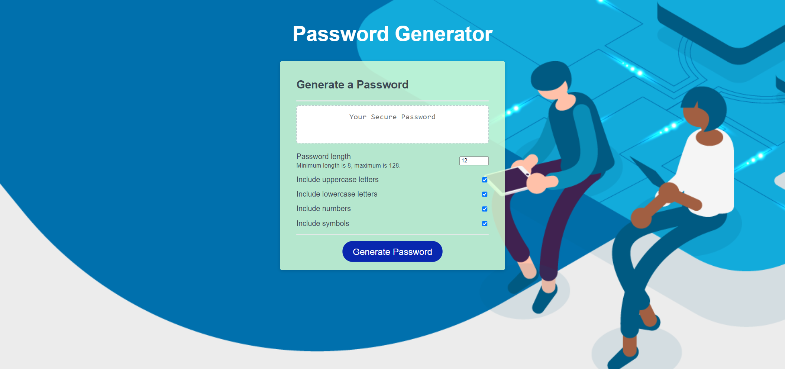

# Password Generator

## Description

This is a password generator using HTML, CSS, and JavaScript. Most of the functionality is based in the JavaScript code. The Assignment code section lists constants based on the IDs specified in the HTML and to be used throughout the JS code. Rather than use prompts and confirms, it made more sense to add check boxes to the HTML code for the user to select the criteria they would like. The event listener code verifies the criteria that are checked, where as the next function of "generatePassword" works to verify which criteria will be used in the final password. The final section of functions generate the character of their specified criteria. 

## Link to Live Password Generator Page

[Here is the live Password Generator page]()

## Screenshot of Password Generator

